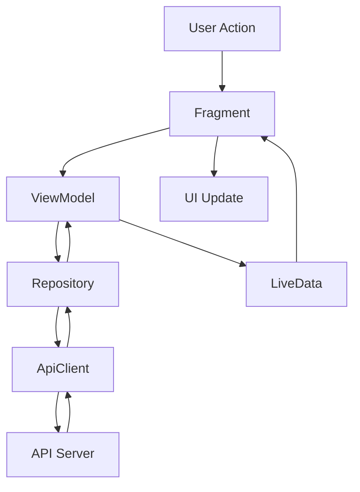
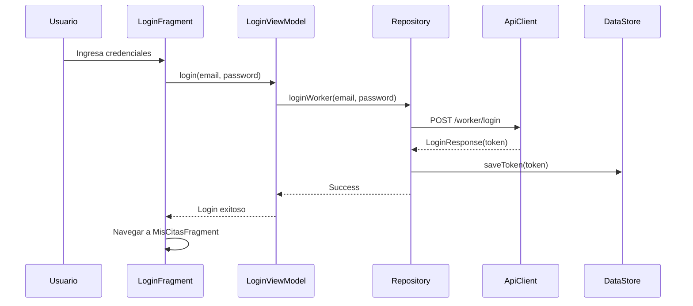
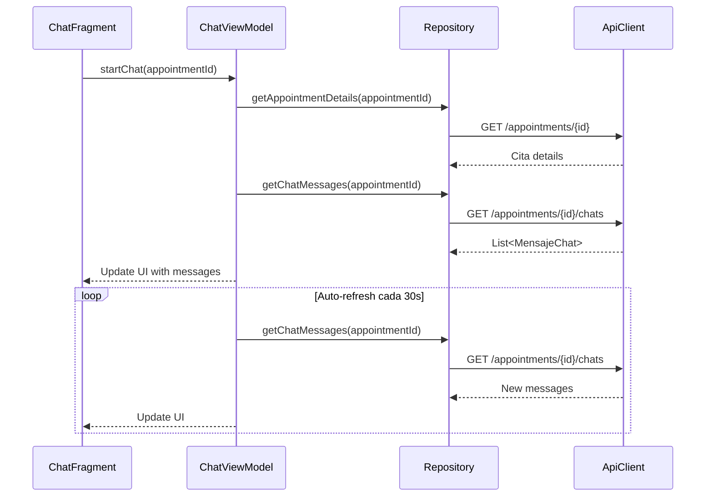

# 🏗️ Documentación de Arquitectura Técnica

## 📐 Visión General de la Arquitectura

La **App Trabajador** está construida siguiendo principios de **Clean Architecture** y **MVVM (Model-View-ViewModel)**, proporcionando una separación clara de responsabilidades, mantenibilidad y testabilidad del código.

## 🔧 Capas de la Arquitectura

### 📱 Capa de Presentación (UI Layer)
Responsable de mostrar datos al usuario y capturar interacciones.

#### Componentes:
- **Activities**: `MainActivity` - Punto de entrada principal
- **Fragments**: Pantallas modulares de la aplicación
- **Adapters**: Para RecyclerViews y listas de datos
- **ViewBinding**: Vinculación type-safe de vistas

#### Fragments Principales:
```kotlin
ui/fragments/
├── LoginFragment.kt              // Autenticación de usuario
├── HomeTrabajadorFragment.kt     // Menú principal del trabajador
├── MisCitasFragment.kt          // Lista de citas asignadas
├── ChatFragment.kt              // Chat con cliente específico
├── MapaFragment.kt              // Visualización de mapas
├── WorkerRegisterStep1Fragment.kt // Registro: Datos básicos
├── WorkerRegisterStep2Fragment.kt // Registro: Foto de perfil
└── WorkerRegisterStep3Fragment.kt // Registro: Categorías
```

### 🧠 Capa de Lógica de Negocio (ViewModel Layer)
Gestiona el estado de la UI y la lógica de presentación.

#### ViewModels Implementados:
```kotlin
ui/viewmodels/
├── LoginViewModel.kt              // Lógica de autenticación
├── CitasViewModel.kt             // Gestión de lista de citas
├── ChatViewModel.kt              // Lógica de chat y mensajería
├── AppointmentDialogViewModel.kt  // Confirmación/finalización de citas
└── WorkerRegisterViewModel.kt     // Proceso de registro completo
```

#### Características de ViewModels:
- **LiveData** para datos observables
- **Coroutines** para operaciones asíncronas
- **Error handling** centralizado
- **Loading states** para UX fluida

### 🗄️ Capa de Datos (Data Layer)
Gestiona el acceso y persistencia de datos.

#### Repository Pattern:
```kotlin
repositories/
└── AppRepository.kt              // Punto único de acceso a datos
```

#### Responsabilidades del Repository:
- Abstracción entre ViewModels y fuentes de datos
- Gestión de caché y sincronización
- Transformación de datos entre capas
- Manejo de tokens de autenticación

### 🌐 Capa de Red (Network Layer)
Comunicación con servicios externos.

```kotlin
data/network/
├── ApiClient.kt                  // Interface Retrofit con endpoints
├── RetrofitHelper.kt            // Configuración de Retrofit
└── AuthInterceptor.kt           // Interceptor para autenticación
```

#### Configuración de Red:
- **Retrofit** para llamadas REST
- **OkHttp** para interceptores y logging
- **Gson** para serialización JSON
- **Autenticación JWT** automática

### 💾 Capa de Persistencia (Storage Layer)
Almacenamiento local de datos.

```kotlin
data/datastore/
└── TokenDataStore.kt            // Almacenamiento seguro de tokens
```

#### Tecnologías de Persistencia:
- **DataStore Preferences** para configuraciones
- **Tokens JWT** para sesiones de usuario

## 📊 Modelos de Datos

### 🏢 Entidades Principales

#### Usuario y Trabajador
```kotlin
data class MeResponse(
    val id: Int,
    val name: String,
    val email: String,
    val profile: Profile,
    val worker: WorkerInfo
)

data class WorkerInfo(
    val id: Int,
    val user_id: Int,
    val picture_url: String?,
    val average_rating: String?,
    val reviews_count: Int?
)
```

#### Citas y Servicios
```kotlin
data class Cita(
    val id: Int,
    val worker_id: Int,
    val user_id: Int,
    val appointment_date: String?,
    val appointment_time: String?,
    val category_selected_id: Int,
    val latitude: String?,
    val longitude: String?,
    val status: Int,                // 0=pendiente, 1=solicitada, 2=confirmada, 3=finalizada
    val category: Category,
    val client: Client
)
```

#### Sistema de Chat
```kotlin
data class MensajeChat(
    val id: Int,
    val appointment_id: Int,
    val sender_id: Int,
    val receiver_id: Int,
    val date_sent: String,
    val message: String,
    val appointment: ChatAppointment,
    val sender: ChatUser,
    val receiver: ChatUser
)
```

### 📋 Estados de Cita

| Estado | Valor | Descripción | Acciones Disponibles |
|--------|-------|-------------|---------------------|
| **Pendiente** | 0 | Cita asignada, sin acción | Chat, Ver mapa |
| **Solicitada** | 1 | Cliente solicitó servicio | **Confirmar**, Chat, Ver mapa |
| **Confirmada** | 2 | Trabajo confirmado | **Finalizar**, Chat, Ver mapa |
| **Finalizada** | 3 | Trabajo completado | Chat, Ver mapa |

## 🔄 Flujo de Datos

### 📱 Patrón Unidireccional


### 🔐 Flujo de Autenticación


### 💬 Flujo de Chat


## 🗺️ Navegación

### 🧭 Navigation Component
La aplicación utiliza **Android Navigation Component** con **Safe Args** para navegación type-safe entre destinos.

#### Grafo de Navegación Principal:
```xml
nav_graph.xml
├── loginFragment (start destination)
├── homeTrabajadorFragment
├── misCitasFragment
├── chatFragment
├── mapaFragment
└── register_flow (nested graph)
    ├── workerRegisterStep1Fragment
    ├── workerRegisterStep2Fragment
    └── workerRegisterStep3Fragment
```

#### Navegación Programática:
```kotlin
// Navegación con argumentos type-safe
val action = MisCitasFragmentDirections
    .actionMisCitasFragmentToChatFragment(citaId = cita.id)
findNavController().navigate(action)

// Navegación con coordenadas de mapa
val action = ChatFragmentDirections
    .actionChatFragmentToMapaFragment(latitude, longitude)
findNavController().navigate(action)
```

## ⚡ Gestión de Estado

### 📊 LiveData y Observer Pattern
```kotlin
class CitasViewModel(private val repository: AppRepository) : ViewModel() {
    
    private val _citas = MutableLiveData<List<Cita>>()
    val citas: LiveData<List<Cita>> = _citas
    
    private val _isLoading = MutableLiveData<Boolean>()
    val isLoading: LiveData<Boolean> = _isLoading
    
    private val _errorMessage = MutableLiveData<String>()
    val errorMessage: LiveData<String> = _errorMessage
    
    fun loadCitas() {
        _isLoading.value = true
        viewModelScope.launch {
            try {
                val response = repository.getCitas()
                if (response.isSuccessful) {
                    _citas.value = response.body() ?: emptyList()
                } else {
                    _errorMessage.value = "Error al cargar citas"
                }
            } catch (e: Exception) {
                _errorMessage.value = "Error de conexión: ${e.message}"
            } finally {
                _isLoading.value = false
            }
        }
    }
}
```

### 🔄 Manejo de Estados de Carga
```kotlin
// En el Fragment
citasViewModel.isLoading.observe(viewLifecycleOwner) { isLoading ->
    binding.progressBar.visibility = if (isLoading) View.VISIBLE else View.GONE
}

citasViewModel.errorMessage.observe(viewLifecycleOwner) { message ->
    Toast.makeText(context, message, Toast.LENGTH_SHORT).show()
}
```

## 🔒 Seguridad

### 🔑 Autenticación JWT
- Tokens almacenados de forma segura en **DataStore**
- **AuthInterceptor** añade automáticamente headers de autorización
- Renovación automática de tokens cuando expiran
- Limpieza de datos al cerrar sesión

### 🛡️ Interceptor de Autenticación
```kotlin
class AuthInterceptor(private val tokenDataStore: TokenDataStore) : Interceptor {
    override fun intercept(chain: Interceptor.Chain): Response {
        val originalRequest = chain.request()
        
        // Obtener token del DataStore
        val token = runBlocking { tokenDataStore.getToken.first() }
        
        val newRequest = if (!token.isNullOrBlank()) {
            originalRequest.newBuilder()
                .addHeader("Authorization", "Bearer $token")
                .build()
        } else {
            originalRequest
        }
        
        return chain.proceed(newRequest)
    }
}
```

## 🔧 Configuración y Build

### 📦 Dependencias Principales
```kotlin
dependencies {
    // Core Android
    implementation("androidx.core:core-ktx:1.12.0")
    implementation("androidx.appcompat:appcompat:1.6.1")
    implementation("com.google.android.material:material:1.11.0")
    
    // Architecture Components
    implementation("androidx.lifecycle:lifecycle-viewmodel-ktx:2.7.0")
    implementation("androidx.lifecycle:lifecycle-livedata-ktx:2.7.0")
    implementation("androidx.navigation:navigation-fragment-ktx:2.7.6")
    implementation("androidx.navigation:navigation-ui-ktx:2.7.6")
    
    // Networking
    implementation("com.squareup.retrofit2:retrofit:2.9.0")
    implementation("com.squareup.retrofit2:converter-gson:2.9.0")
    implementation("com.squareup.okhttp3:okhttp:4.9.1")
    
    // Data Persistence
    implementation("androidx.datastore:datastore-preferences:1.0.0")
    
    // UI Components
    implementation("androidx.recyclerview:recyclerview:1.3.2")
    implementation("com.github.bumptech.glide:glide:4.16.0")
    
    // Maps
    implementation("com.google.android.gms:play-services-maps:18.2.0")
}
```

### 🏗️ Configuración de Build
```kotlin
android {
    compileSdk = 36
    defaultConfig {
        applicationId = "com.example.proyectoapptrabajador"
        minSdk = 24
        targetSdk = 36
        versionCode = 1
        versionName = "1.0"
    }
    
    buildFeatures {
        viewBinding = true
    }
    
    compileOptions {
        sourceCompatibility = JavaVersion.VERSION_11
        targetCompatibility = JavaVersion.VERSION_11
    }
}
```

## 📈 Métricas y Rendimiento

### ⚡ Optimizaciones Implementadas
- **LazyLoading** de imágenes con Glide
- **ViewBinding** para eficiencia de vistas
- **Coroutines** para operaciones asíncronas no-bloqueantes
- **Pagination** implícita en listas grandes
- **Caché** de datos en Repository

### 📊 Puntos de Monitoreo
- Tiempo de respuesta de API calls
- Estados de loading en UI
- Manejo de errores de red
- Uso de memoria en listas grandes
- Tiempo de navegación entre pantallas

## 🧪 Testing

### 🎯 Estrategia de Testing
- **Unit Tests** para ViewModels y Repository
- **UI Tests** para flujos críticos de usuario
- **Integration Tests** para comunicación con API

### 🔬 Áreas de Testing Recomendadas
```kotlin
// Unit Tests
class CitasViewModelTest {
    @Test
    fun `when loadCitas called, should update citas LiveData`() { }
    
    @Test
    fun `when API call fails, should update errorMessage`() { }
}

// UI Tests
class LoginFlowTest {
    @Test
    fun loginWithValidCredentials_navigatesToCitasList() { }
    
    @Test
    fun loginWithInvalidCredentials_showsErrorMessage() { }
}
```

## 🚀 Despliegue

### 📱 Configuración de Release
- **ProGuard** para ofuscación de código
- **Firma de APK** con keystore seguro
- **Minificación** para reducir tamaño del APK
- **Configuración de múltiples entornos** (dev, staging, production)

### 🔧 Variables de Entorno
```properties
# local.properties
MAPS_API_KEY=your_google_maps_api_key
API_BASE_URL=https://your-api-server.com/api/
DEBUG_MODE=true
```

---

*Esta arquitectura proporciona una base sólida, escalable y mantenible para el crecimiento continuo de la aplicación.*