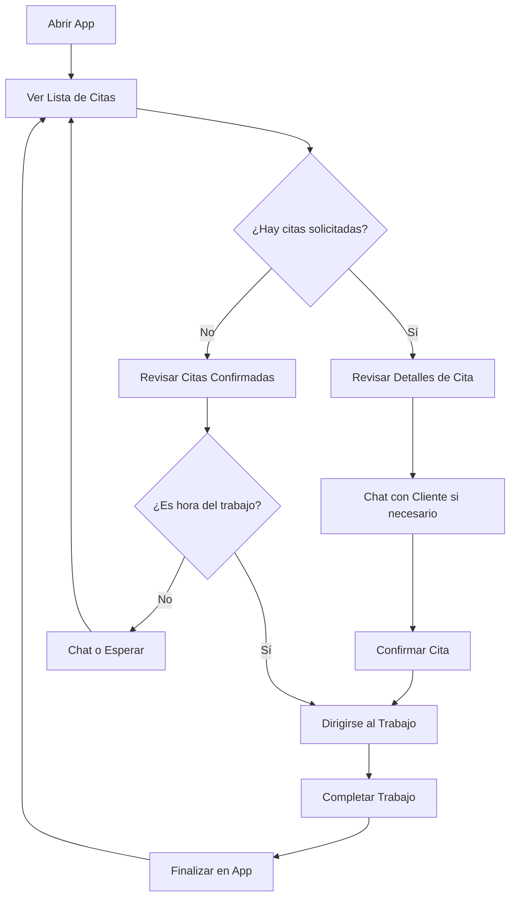

# 👤 Guía de Usuario - App Trabajador

## 🎯 Introducción

La **App Trabajador** es tu herramienta profesional para gestionar servicios a domicilio de manera eficiente. Esta guía te ayudará a aprovechar al máximo todas las funcionalidades de la aplicación.

## 🚀 Primeros Pasos

### 📱 Instalación
1. Descarga la aplicación desde la fuente autorizada
2. Instala en tu dispositivo Android (requiere Android 7.0 o superior)
3. Abre la aplicación

### 🔐 Primer Acceso

#### Si ya tienes cuenta:
1. Ingresa tu **email** y **contraseña**
2. Toca **"Iniciar Sesión"**
3. La app te llevará automáticamente a tus citas

#### Si eres nuevo:
1. Toca **"¿No tienes cuenta? Regístrate"**
2. Completa el proceso de registro en 3 pasos

## 📝 Proceso de Registro (3 Pasos)

### 📋 Paso 1: Datos Personales
Completa tu información básica:
- **Nombre**: Tu nombre real
- **Apellido**: Tu apellido
- **Email**: Email válido (será tu usuario)
- **Contraseña**: Mínimo 8 caracteres, segura

> 💡 **Tip**: Usa un email que revises frecuentemente, recibirás notificaciones importantes.

### 📷 Paso 2: Foto de Perfil
Sube una foto profesional:
- Toca **"Seleccionar Foto"**
- Elige desde galería o toma una nueva
- Asegúrate que se vea claramente tu rostro
- Toca **"Subir Foto"**

> 🎯 **Importante**: Una buena foto genera más confianza en los clientes.

### 🏷️ Paso 3: Categorías de Servicios
Selecciona los servicios que ofreces:
- Marca todas las categorías en las que tienes experiencia
- Puedes seleccionar múltiples opciones
- Ejemplos: Plomería, Electricidad, Carpintería, Pintura, etc.
- Toca **"Finalizar Registro"**

> ⚠️ **Nota**: Solo recibirás citas de las categorías que selecciones.

## 🏠 Pantalla Principal

### 📊 Vista General
Al iniciar sesión verás:
- **Header superior**: Tu nombre y botón de perfil
- **Lista de citas**: Todas tus citas asignadas
- **Estados visuales**: Colores que indican el estado de cada cita

### 🎨 Códigos de Color
- 🟡 **Amarillo**: Cita pendiente
- 🔵 **Azul**: Cita solicitada (requiere tu confirmación)
- 🟢 **Verde**: Cita confirmada (trabajo en progreso)
- ⚪ **Gris**: Cita finalizada

## 📅 Gestión de Citas

### 📋 Lista de Citas
Cada tarjeta de cita muestra:
- **Nombre del cliente**
- **Categoría del servicio**
- **Fecha y hora** (si está programada)
- **Estado actual**
- **Botones de acción** según el estado

### 🔄 Estados de Cita y Acciones

#### 🟡 Cita Pendiente (Estado 0)
**Descripción**: Cita asignada, esperando que el cliente defina detalles.
**Acciones disponibles**:
- 💬 **Chat**: Comunicarte con el cliente
- 🗺️ **Ver Mapa**: Si hay ubicación disponible

#### 🔵 Cita Solicitada (Estado 1)
**Descripción**: El cliente ha solicitado el servicio y espera tu confirmación.
**Acciones disponibles**:
- ✅ **Confirmar Cita**: Aceptar el trabajo (ACCIÓN PRINCIPAL)
- 💬 **Chat**: Comunicarte con el cliente
- 🗺️ **Ver Mapa**: Ver ubicación del trabajo

> 🚨 **¡Importante!**: Las citas solicitadas requieren tu confirmación rápida para mantener la satisfacción del cliente.

#### 🟢 Cita Confirmada (Estado 2)
**Descripción**: Has confirmado el trabajo y está en progreso.
**Acciones disponibles**:
- 🏁 **Finalizar Trabajo**: Marcar como completado (ACCIÓN PRINCIPAL)
- 💬 **Chat**: Comunicarte con el cliente
- 🗺️ **Ver Mapa**: Navegar a la ubicación

#### ⚪ Cita Finalizada (Estado 3)
**Descripción**: Trabajo completado exitosamente.
**Acciones disponibles**:
- 💬 **Chat**: Revisar historial de conversación
- 🗺️ **Ver Mapa**: Revisar ubicación del trabajo

## 💬 Sistema de Chat

### 🗨️ Comunicación con Clientes
El chat te permite:
- **Comunicación directa** con cada cliente
- **Aclarar dudas** sobre el trabajo
- **Coordinar horarios** y detalles
- **Mantener registro** de toda la comunicación

### 📱 Cómo usar el Chat
1. **Acceder**: Toca el botón 💬 en cualquier cita
2. **Ver historial**: Revisa mensajes anteriores
3. **Escribir mensaje**: Usa la caja de texto inferior
4. **Enviar**: Toca el botón de envío ➤
5. **Actualización automática**: Los mensajes se actualizan cada 30 segundos

### 💡 Consejos para el Chat
- **Sé profesional** en tus mensajes
- **Responde rápido** para generar confianza
- **Confirma detalles** importantes como hora y dirección
- **Mantén información clara** sobre tu progreso

## 🗺️ Funciones de Mapa

### 📍 Ver Ubicaciones
- **Acceso**: Toca el botón 🗺️ en citas con ubicación
- **Vista de mapa**: Google Maps integrado
- **Punto marcado**: Ubicación exacta del trabajo
- **Navegación**: Toca el marcador para abrir navegación

### 🧭 Navegación
- La app abre automáticamente tu app de mapas preferida
- Obtén direcciones desde tu ubicación actual
- Calcula tiempo estimado de llegada

## ⚙️ Perfil del Trabajador

### 👤 Acceder al Perfil
1. Toca tu **nombre** en el header superior
2. O toca el **botón de perfil** 👤

### 🔧 Opciones del Perfil
- **Ver información personal**
- **Actualizar foto de perfil**
- **Modificar categorías de servicios**
- **Cerrar sesión**

### 📸 Actualizar Foto
1. Ve a **"Actualizar Foto de Perfil"**
2. Selecciona nueva imagen
3. Confirma el cambio
4. La nueva foto se mostrará en tu perfil

### 🏷️ Modificar Categorías
1. Ve a **"Actualizar Categorías"**
2. Selecciona/deselecciona servicios
3. Guarda los cambios
4. Solo recibirás citas de categorías seleccionadas

## 🔔 Notificaciones y Alertas

### 📢 Tipos de Notificaciones
- **Nueva cita asignada**
- **Cliente solicitó servicio** (requiere confirmación)
- **Nuevo mensaje en chat**
- **Recordatorios de cita**

### 🔕 Gestionar Notificaciones
- Configura desde los ajustes de Android
- Se recomienda mantener activadas para no perder oportunidades

## ✅ Confirmación de Trabajos

### 🤝 Confirmar una Cita Solicitada
1. **Ve a la cita** con estado "Solicitada" (azul)
2. **Revisa los detalles**: cliente, servicio, ubicación, fecha/hora
3. **Toca "Confirmar Cita"**
4. **Confirma en el diálogo** emergente
5. **El estado cambia** a "Confirmada" (verde)

### ⚠️ Consideraciones Importantes
- **Una vez confirmada**, el cliente espera que cumplas
- **Revisa tu agenda** antes de confirmar
- **Verifica la ubicación** para asegurar que puedes llegar
- **Si tienes dudas**, usa el chat para preguntar al cliente

## 🏁 Finalización de Trabajos

### ✅ Finalizar una Cita Confirmada
1. **Completa el trabajo** en la ubicación del cliente
2. **Ve a la app** y abre la cita
3. **Toca "Finalizar Trabajo"**
4. **Confirma en el diálogo** emergente
5. **El estado cambia** a "Finalizada" (gris)

### 📋 Después de Finalizar
- La cita queda registrada en tu historial
- El cliente puede dejarte una reseña
- Puedes seguir usando el chat si es necesario

## 🆘 Solución de Problemas

### 🔧 Problemas Comunes

#### "No puedo iniciar sesión"
- Verifica tu conexión a internet
- Confirma email y contraseña correctos
- Intenta cerrar y abrir la app

#### "No veo mis citas"
- Verifica tu conexión a internet
- Desliza hacia abajo para actualizar
- Cierra y abre la app

#### "El chat no se actualiza"
- Verifica tu conexión a internet
- El chat se actualiza automáticamente cada 30 segundos
- Puedes salir y volver a entrar al chat

#### "No puedo ver el mapa"
- Verifica permisos de ubicación
- Confirma que tienes Google Maps instalado
- Verifica conexión a internet

#### "Error al subir foto"
- Verifica conexión a internet
- Intenta con una foto de menor tamaño
- Usa formato JPG o PNG

### 📞 Contacto de Soporte
Si persisten los problemas:
- Reporta en la sección de issues del repositorio
- Incluye detalles del error y pasos para reproducirlo

## 💼 Mejores Prácticas

### 🏆 Para Ser un Trabajador Exitoso

#### ⏰ Gestión de Tiempo
- **Revisa la app regularmente** para nuevas citas
- **Confirma citas rápidamente** cuando estés disponible
- **Planifica tu ruta** para optimizar desplazamientos

#### 🤝 Servicio al Cliente
- **Mantén comunicación activa** a través del chat
- **Sé puntual** en tus citas confirmadas
- **Profesionalismo** en todas las interacciones

#### 📱 Uso de la App
- **Mantén actualizada** tu información de perfil
- **Finaliza trabajos** inmediatamente al completarlos
- **Usa el chat** para mantener al cliente informado

#### 💡 Consejos Adicionales
- **Foto de perfil profesional** genera más confianza
- **Respuesta rápida** en chats mejora tu reputación
- **Confirma solo citas** que estés seguro de cumplir

## 🔒 Privacidad y Seguridad

### 🛡️ Protección de Datos
- Tus datos personales están protegidos
- La comunicación está cifrada
- Solo compartes información necesaria con clientes

### 🔐 Consejos de Seguridad
- **No compartas** información personal adicional
- **Mantén privadas** tus credenciales de acceso
- **Reporta** cualquier comportamiento inapropiado de clientes

---

## 🎯 Resumen de Flujo Típico

¡Felicidades! Ahora tienes todo lo necesario para usar eficientemente la App Trabajador y brindar un excelente servicio a tus clientes. 🎉