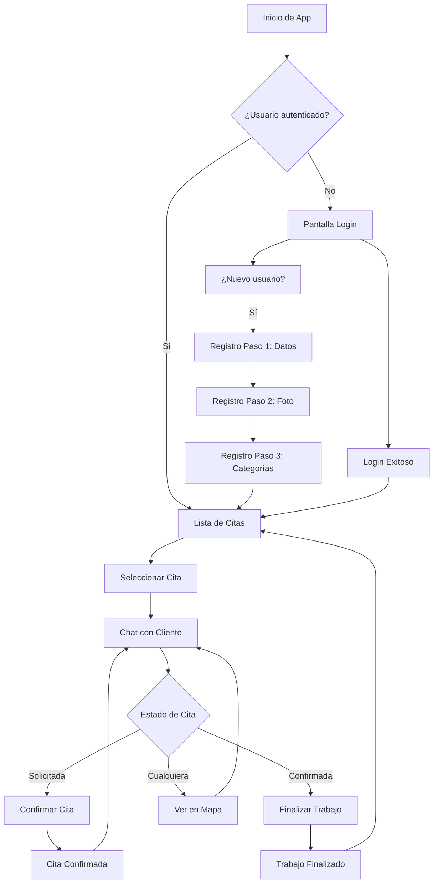

# 🔧 App Trabajador - Sistema de Servicios a Domicilio

## 📋 Descripción del Proyecto

**App Trabajador** es una aplicación móvil Android nativa desarrollada en Kotlin que forma parte de un sistema integral de servicios a domicilio. Esta aplicación está diseñada específicamente para **trabajadores de servicios** que necesitan gestionar sus citas, comunicarse con clientes y administrar su perfil profesional.

### 🎯 Propósito

La aplicación permite a los trabajadores de servicios (plomeros, electricistas, técnicos, etc.) gestionar eficientemente sus trabajos asignados, mantener comunicación directa con sus clientes y ofrecer un servicio profesional y confiable.

## ✨ Características Principales

### 🔐 Sistema de Autenticación
- **Login seguro** con email y contraseña
- **Registro en 3 pasos** progresivo y guiado:
  1. Datos personales básicos
  2. Foto de perfil profesional
  3. Selección de categorías de servicios

### 📱 Gestión de Citas
- **Lista completa** de citas asignadas
- **Estados de cita** claramente diferenciados:
  - 🟡 **Pendiente** - Cita asignada, esperando acción del trabajador
  - 🔵 **Solicitada** - Cliente ha solicitado el servicio, requiere confirmación
  - 🟢 **Confirmada** - Trabajo confirmado y en progreso
  - ✅ **Finalizada** - Trabajo completado satisfactoriamente
- **Información detallada** de cada cita (cliente, categoría, fecha, hora, ubicación)

### 💬 Sistema de Chat Integrado
- **Comunicación directa** con el cliente para cada cita
- **Mensajería en tiempo real** con actualizaciones automáticas
- **Interfaz intuitiva** diseñada para uso en campo
- **Histórico completo** de conversaciones por cita

### 🗺️ Integración con Mapas
- **Google Maps integrado** para visualizar ubicaciones
- **Navegación directa** a la dirección del cliente
- **Coordenadas precisas** para ubicaciones exactas
- **Visualización de ruta** desde la ubicación actual

### 👤 Perfil Profesional
- **Gestión completa** del perfil del trabajador
- **Categorías de servicios** que el trabajador puede ofrecer
- **Foto de perfil** profesional
- **Información de contacto** actualizable

## 🏗️ Arquitectura Técnica

### 📐 Patrón de Diseño
- **MVVM (Model-View-ViewModel)** para separación clara de responsabilidades
- **Repository Pattern** para abstracción de datos
- **LiveData y Observer Pattern** para UI reactiva
- **Navigation Component** para navegación type-safe

### 🛠️ Tecnologías Utilizadas

#### Core Android
- **Kotlin** como lenguaje principal
- **Android SDK** (mínimo API 24, objetivo API 36)
- **ViewBinding** para vinculación de vistas type-safe
- **Material Design 3.0** para UI/UX moderna

#### Arquitectura y Navegación
- **ViewModel y LiveData** para gestión de estado
- **Navigation Component** con Safe Args
- **Fragmentos** para modularidad de UI

#### Networking y Datos
- **Retrofit 2** para comunicación con API REST
- **OkHttp** para interceptores y logging
- **Gson** para serialización JSON
- **DataStore** para almacenamiento de preferencias

#### UI y UX
- **RecyclerView** para listas eficientes
- **Google Maps Android API** para mapas
- **Glide** para carga de imágenes
- **Material Components** para componentes UI

#### Gestión de Estado
- **Kotlin Coroutines** para programación asíncrona
- **Flow y LiveData** para streams de datos reactivos

## 🚀 Instalación y Configuración

### 📋 Prerrequisitos

1. **Android Studio** Arctic Fox o superior
2. **JDK 11** o superior
3. **Gradle 7.0** o superior
4. **API Key de Google Maps** (para funcionalidad de mapas)

### ⚙️ Configuración Inicial

1. **Clonar el repositorio:**
   ```bash
   git clone https://github.com/Mario-pereyra/Proyecto_app_trabajador.git
   cd Proyecto_app_trabajador
   ```

2. **Configurar Google Maps API:**
   - Obtener API Key desde [Google Cloud Console](https://console.cloud.google.com/)
   - Crear archivo `local.properties` en la raíz del proyecto:
     ```properties
     MAPS_API_KEY=TU_API_KEY_AQUI
     ```
   - La clave se configurará automáticamente en el AndroidManifest.xml

3. **Configurar servidor backend:**
   - Asegurar que el servidor API esté ejecutándose
   - Configurar la URL base en `RetrofitHelper.kt` si es necesario

4. **Sincronizar proyecto:**
   - Abrir proyecto en Android Studio
   - Hacer clic en "Sync Project with Gradle Files"

### 🔧 Compilación y Ejecución

1. **Compilar en Android Studio:**
   - Seleccionar "Build > Make Project"
   - O usar el atajo `Ctrl+F9` (Windows/Linux) / `Cmd+F9` (macOS)

2. **Ejecutar en dispositivo/emulador:**
   - Conectar dispositivo Android o iniciar emulador
   - Hacer clic en "Run app" o usar `Shift+F10`

3. **Compilar desde línea de comandos:**
   ```bash
   ./gradlew assembleDebug        # Compilar versión debug
   ./gradlew assembleRelease      # Compilar versión release
   ./gradlew installDebug         # Instalar en dispositivo conectado
   ```

## 📊 Flujo de Usuario

### 🎯 Flujo Principal del Trabajador



### 📱 Pantallas Principales

1. **LoginFragment** - Autenticación de usuario
2. **HomeTrabajadorFragment** - Menú principal del trabajador
3. **MisCitasFragment** - Lista de todas las citas asignadas
4. **ChatFragment** - Comunicación con cliente específico
5. **MapaFragment** - Visualización de ubicación del trabajo
6. **Registro (3 pasos)** - Proceso completo de registro

## 🔗 Integración con Sistema

Esta aplicación forma parte de un **ecosistema de dos aplicaciones**:

- **📱 App Cliente** - Para usuarios que solicitan servicios
- **🔧 App Trabajador** - Para profesionales que ofrecen servicios (esta app)

### 🌐 Comunicación con Backend

La aplicación se comunica con una **API REST** que gestiona:
- Autenticación y autorización
- Gestión de usuarios y trabajadores
- Administración de citas y estados
- Sistema de mensajería en tiempo real
- Gestión de categorías de servicios

## 🤝 Contribución

### 📋 Guías de Desarrollo

1. **Estilo de Código:**
   - Seguir convenciones de Kotlin
   - Usar nombres descriptivos para variables y funciones
   - Documentar funciones públicas con KDoc

2. **Arquitectura:**
   - Mantener separación MVVM
   - Usar Repository para acceso a datos
   - Implementar casos de uso complejos en ViewModels

3. **UI/UX:**
   - Seguir Material Design guidelines
   - Mantener consistencia con la guía de estilo existente
   - Priorizar accesibilidad y usabilidad

### 🔄 Proceso de Contribución

1. Fork del repositorio
2. Crear rama feature: `git checkout -b feature/nueva-funcionalidad`
3. Commit cambios: `git commit -m 'Agregar nueva funcionalidad'`
4. Push a la rama: `git push origin feature/nueva-funcionalidad`
5. Crear Pull Request con descripción detallada

## 📄 Licencia

Este proyecto es parte de un sistema propietario de gestión de servicios a domicilio.

## 🆘 Soporte y Contacto

Para soporte técnico, reportar bugs o solicitar nuevas funcionalidades:

- **Repositorio:** [GitHub Issues](https://github.com/Mario-pereyra/Proyecto_app_trabajador/issues)
- **Documentación adicional:** Ver archivos en `/docs`

---

*Desarrollado con ❤️ para mejorar la experiencia de trabajadores de servicios y sus clientes.*