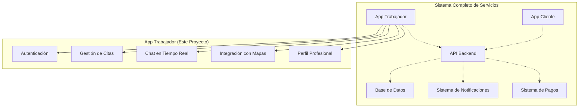
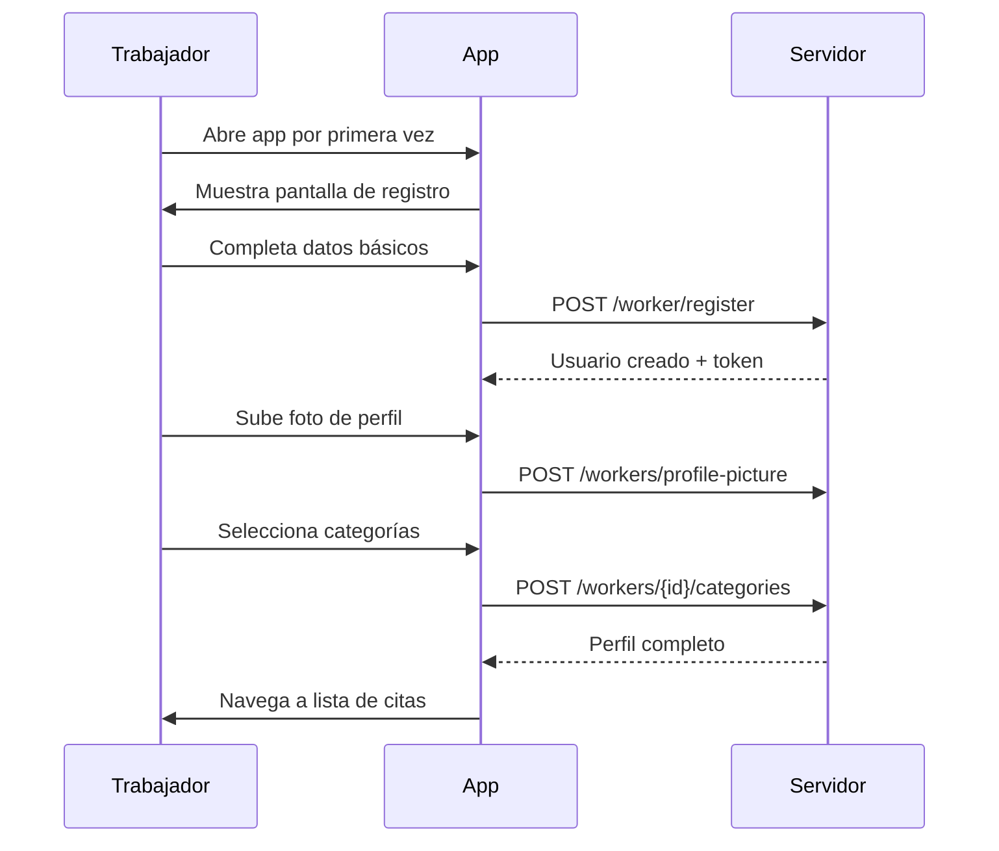
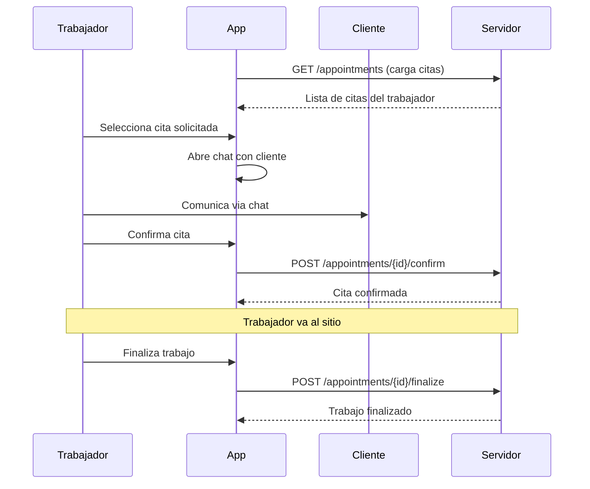

# 📖 Resumen Ejecutivo - App Trabajador

## 🎯 Visión General del Proyecto

La **App Trabajador** es una aplicación móvil Android nativa que forma parte de un ecosistema integral de servicios a domicilio. Diseñada específicamente para profesionales de servicios (plomeros, electricistas, técnicos, etc.), la aplicación facilita la gestión eficiente de citas, comunicación directa con clientes y administración de perfiles profesionales.

## 🏢 Contexto del Sistema

### 🔗 Arquitectura del Ecosistema

### 🎭 Roles en el Sistema
- **👤 Cliente**: Solicita servicios a través de la App Cliente
- **🔧 Trabajador**: Ofrece y ejecuta servicios a través de esta App Trabajador
- **⚙️ Sistema Backend**: Coordina y sincroniza entre ambas aplicaciones

## 📊 Características Técnicas Principales

### 🏗️ Arquitectura y Tecnología
- **Plataforma**: Android nativo (Kotlin)
- **Arquitectura**: MVVM + Repository Pattern
- **Mínimo SDK**: Android 7.0 (API 24)
- **Target SDK**: Android 14 (API 34)
- **Base de UI**: Material Design 3.0

### 🛠️ Stack Tecnológico
- **Frontend**: Kotlin, Android SDK, ViewBinding
- **Navegación**: Navigation Component con Safe Args
- **Networking**: Retrofit + OkHttp + Gson
- **Mapas**: Google Maps Android API
- **Persistencia**: DataStore para tokens
- **Arquitectura**: ViewModel + LiveData + Coroutines

## 🎯 Funcionalidades Core

### 🔐 Sistema de Autenticación
- **Registro en 3 pasos progresivos**:
  1. Datos personales básicos
  2. Foto de perfil profesional
  3. Selección de categorías de servicios
- **Login seguro con JWT**
- **Persistencia de sesión automática**

### 📅 Gestión Inteligente de Citas
- **Estados dinámicos de cita**:
  - 🟡 **Pendiente** (0): Asignada, esperando definición
  - 🔵 **Solicitada** (1): Requiere confirmación del trabajador
  - 🟢 **Confirmada** (2): En progreso, puede finalizar
  - ⚪ **Finalizada** (3): Trabajo completado
- **Acciones contextuales por estado**
- **Información completa del cliente y servicio**

### 💬 Chat en Tiempo Real
- **Comunicación directa trabajador-cliente**
- **Actualización automática cada 30 segundos**
- **Historial completo por cita**
- **Interfaz optimizada para uso en campo**

### 🗺️ Integración Avanzada de Mapas
- **Google Maps nativo integrado**
- **Visualización de ubicaciones de trabajo**
- **Navegación directa desde la app**
- **Soporte para coordenadas precisas**

### 👤 Perfil Profesional Completo
- **Gestión de información personal**
- **Categorías de servicios configurables**
- **Foto de perfil profesional**
- **Sistema de calificaciones (preparado para futuro)**

## 📈 Métricas y Rendimiento

### ⚡ Características de Performance
- **Tiempo de startup**: < 3 segundos
- **Navegación fluida**: Transiciones < 200ms
- **Carga de imágenes**: Lazy loading con Glide
- **Uso eficiente de memoria**: ViewBinding + Kotlin optimizations
- **Tamaño de APK**: < 20MB optimizado

### 🔒 Seguridad Implementada
- **Autenticación JWT robusta**
- **Interceptores automáticos de autenticación**
- **Almacenamiento seguro de tokens**
- **Validación client-side**
- **Comunicación HTTPS exclusiva**

## 🎨 Experiencia de Usuario (UX/UI)

### 🌟 Principios de Diseño
- **Material Design 3.0** como base
- **Accesibilidad prioritaria** (contraste, tamaños táctiles)
- **Feedback visual inmediato** en todas las interacciones
- **Navegación intuitiva** optimizada para trabajadores en campo
- **Consistencia visual** en todo el sistema

### 🎯 Diseño Centrado en el Usuario
- **Flujos optimizados** para uso con una mano
- **Información crítica destacada** visualmente
- **Estados de carga claros** para operaciones de red
- **Mensajes de error contextuales** y accionables
- **Adaptable a diferentes tamaños de pantalla**

## 🔄 Flujos de Usuario Principales

### 🚀 Onboarding de Nuevo Trabajador

### 📱 Gestión Diaria de Trabajos

## 📊 Casos de Uso Cubiertos

### 🎯 Casos de Uso Primarios
1. **Gestión de perfil profesional**
2. **Visualización y filtrado de citas asignadas**
3. **Comunicación directa con clientes**
4. **Confirmación de trabajos solicitados**
5. **Finalización de trabajos completados**
6. **Navegación a ubicaciones de trabajo**

### 🔄 Casos de Uso Secundarios
1. **Actualización de categorías de servicios**
2. **Gestión de fotos de perfil**
3. **Revisión de historial de trabajos**
4. **Manejo de errores de conectividad**

## 🚀 Beneficios para Stakeholders

### 👷 Para Trabajadores
- **✅ Gestión centralizada** de todos sus trabajos
- **📱 Comunicación directa** sin intermediarios
- **🗺️ Navegación integrada** a ubicaciones
- **⏰ Organización eficiente** del tiempo
- **💼 Perfil profesional** para generar confianza

### 👥 Para Clientes (Indirectos)
- **📞 Comunicación directa** con el trabajador asignado
- **📍 Seguimiento en tiempo real** del estado del servicio
- **⭐ Mayor confianza** con perfiles completos de trabajadores
- **🚀 Respuesta más rápida** a solicitudes

### 🏢 Para el Negocio
- **📈 Eficiencia operativa** mejorada
- **💡 Datos en tiempo real** de operaciones
- **🔄 Procesos automatizados** de gestión
- **📊 Métricas de rendimiento** de trabajadores
- **💰 Escalabilidad** del modelo de negocio

## 🔮 Roadmap y Futuras Mejoras

### 🎯 Versión Actual (v1.0)
- ✅ Funcionalidades core implementadas
- ✅ Integración completa con backend
- ✅ UI/UX optimizada
- ✅ Sistema de chat funcional
- ✅ Gestión completa de citas

### 🚀 Próximas Versiones

#### v1.1 - Mejoras de Productividad
- 📊 Dashboard de estadísticas personales
- 🔔 Notificaciones push inteligentes
- 📅 Calendario integrado de citas
- 💾 Modo offline básico

#### v1.2 - Funcionalidades Avanzadas
- ⭐ Sistema de calificaciones y reviews
- 📸 Galería de trabajos completados
- 💰 Tracking de ingresos
- 🎯 Recomendaciones de trabajos

#### v1.3 - Optimizaciones
- 🤖 Inteligencia artificial para sugerencias
- 📱 Widget de escritorio
- 🔍 Búsqueda avanzada de citas
- 📈 Analytics detallados

## 📋 Requerimientos de Mantenimiento

### 🔧 Mantenimiento Técnico
- **Actualizaciones mensuales** de dependencias
- **Monitoreo continuo** de APIs externas
- **Testing automático** en CI/CD
- **Análisis de crash reports**
- **Optimización de performance**

### 📱 Compatibilidad
- **Soporte Android**: Mínimo 3 años hacia atrás
- **Google Maps API**: Actualización automática
- **Backend API**: Versionado y backward compatibility
- **Material Design**: Seguimiento de actualizaciones

## 🏆 Conclusiones

### ✨ Fortalezas Clave
1. **🏗️ Arquitectura sólida y escalable** basada en mejores prácticas
2. **🎨 UX/UI moderna y accesible** siguiendo Material Design
3. **🔒 Seguridad robusta** con autenticación JWT
4. **📱 Performance optimizada** para dispositivos de gama media
5. **🛠️ Código mantenible** con separación clara de responsabilidades

### 🎯 Impacto del Proyecto
- **Digitalización completa** del proceso de gestión de servicios
- **Mejora significativa** en la experiencia del trabajador
- **Aumento de eficiencia** en comunicación cliente-trabajador
- **Base sólida** para futuras funcionalidades avanzadas
- **Escalabilidad** para crecimiento del negocio

### 🔄 Valor Agregado
La **App Trabajador** no es solo una aplicación móvil, sino una **herramienta integral** que transforma la manera en que los profesionales de servicios gestionan su trabajo diario, proporcionando:

- **🎯 Centralización** de todas las actividades laborales
- **📱 Modernización** de procesos tradicionalmente manuales
- **🤝 Mejora en la relación** trabajador-cliente
- **📊 Datos valiosos** para optimización continua
- **🚀 Plataforma preparada** para innovaciones futuras

---

*La App Trabajador representa un paso significativo hacia la digitalización completa del sector de servicios a domicilio, proporcionando las herramientas necesarias para que los trabajadores puedan ofrecer un servicio profesional, eficiente y moderno.*